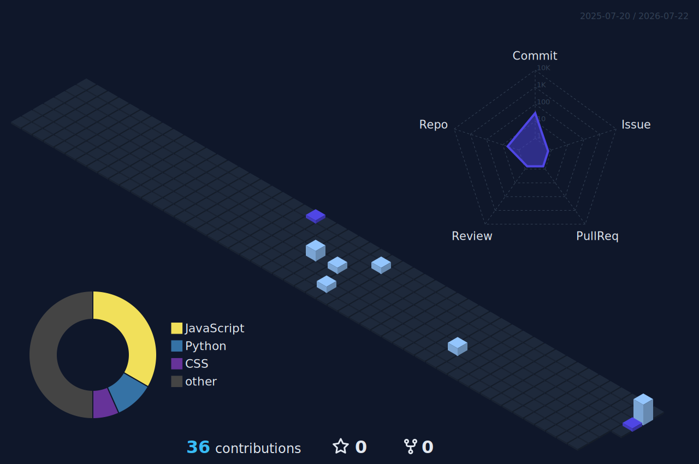

<table width="100%">
<tr>
<td width="230" align="center" valign="middle">

</td>
<td valign="middle">

# Krishna Shouri D S
### Software Engineer · Full-Stack Developer

</td>
</tr>
</table>

### About

I'm **Krishna Shouri D S**, a Software Engineer in the making — currently pursuing my **MCA (Master of Computer Applications)** while building on **7 months of hands-on experience as a Software Engineer Intern**. I take a simple approach: understand the systems I'm building, ship things that hold up in production, and get a little better with every project.

That mindset has already turned into **4 live applications** — from an AI-powered dietary agent to a full car-rental booking platform — each one designed, built, and deployed end to end.

| | |
|:---|:---|
| 🎓 **Education** | MCA (Master of Computer Applications) — in progress |
| 💼 **Experience** | 7 months as a Software Engineer Intern |
| 🚀 **Shipped** | 4 production-deployed applications |
| 🌱 **Focus** | Full-stack fundamentals & real-world engineering practice |
| 📌 **Status** | Open to internship & full-time opportunities |

### Tech Stack

### Featured Work

| Project | What it does | Stack | Live |
|:---|:---|:---|:---|
| [**Dietary-Agent**](https://github.com/kshourids/Dietary-Agent) | AI-powered dietary & nutrition assistant | `Python` `JavaScript` | [Visit ↗](https://dietary-agent.vercel.app) |
| [**LuxeDrive-Car-Rental**](https://github.com/kshourids/LuxeDrive-Car-Rental) | Full car-rental booking platform | `JavaScript` `CSS` | [Visit ↗](https://luxe-drive-car-rental.vercel.app) |
| [**Hindu-Purana-Katha-s**](https://github.com/kshourids/Hindu-Purana-Katha-s) | Storytelling web app for Hindu Puranas | `JavaScript` `CSS` | [Visit ↗](https://hindu-purana-katha-s.vercel.app) |
| [**Portfolio**](https://github.com/kshourids/Portfolio) | My personal developer showcase | `HTML` `CSS` `JS` | [Visit ↗](https://github.com/kshourids/Portfolio) |

### 3D Contribution Graph

### Contribution Snake

<picture>
  <source media="(prefers-color-scheme: dark)" srcset="https://raw.githubusercontent.com/kshourids/kshourids/output/github-contribution-grid-snake-dark.svg" />
  
</picture>

### Activity

 

 

 

### Connect

  

*Building thoughtfully. Learning continuously.*

